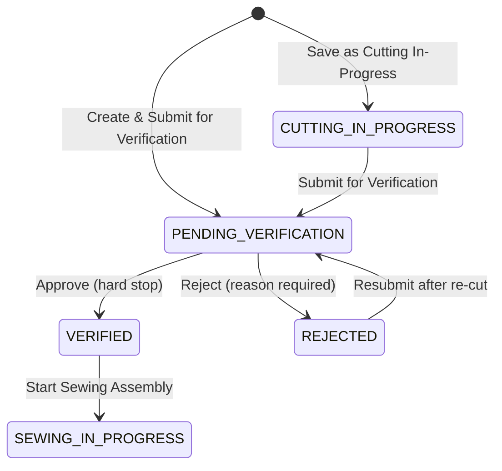
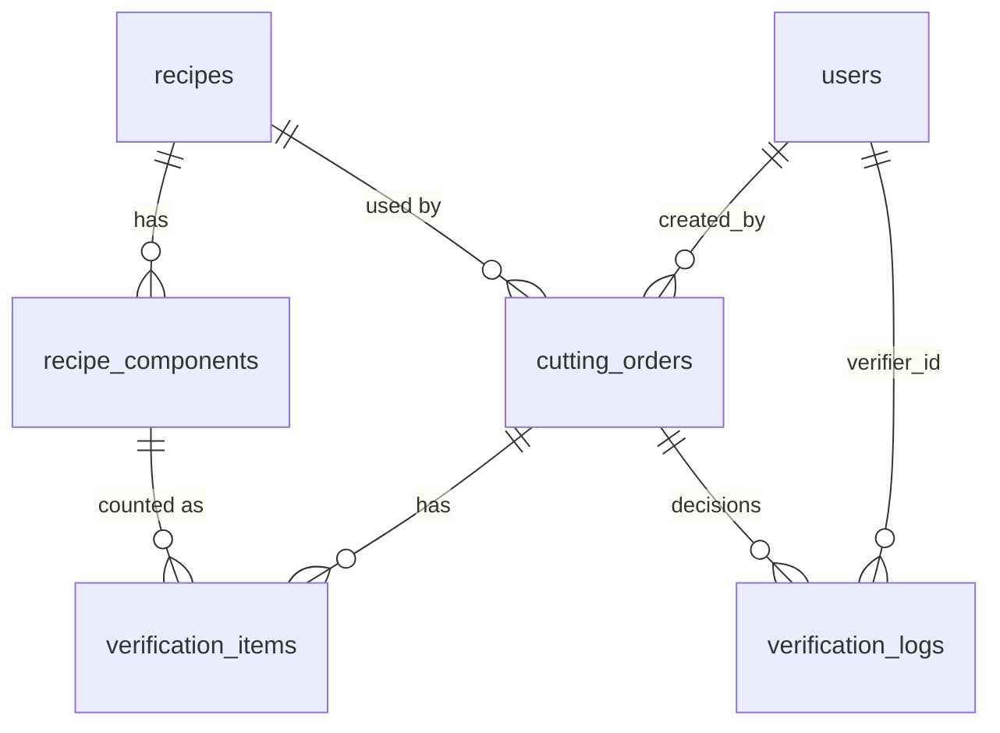

# ApparelFlow ERP · Cutting Gatekeeper

[](https://github.com/YasithaNV2001/apparelflow-erp/actions/workflows/ci.yml)

A web app that controls the hand-off from the cutting floor to the sewing line:

1. **Cutting supervisors** create cutting orders from garment recipes. The server multiplies the recipe into expected piece counts.
2. **Cutting verifiers** physically count every cut component. Each count turns GREEN (match), YELLOW (excess) or RED (short), and a batch can only be approved when nothing is short or uncounted.
3. **Sewing supervisors** only ever see batches that passed verification, together with who verified them and when.

The rules are enforced three times: the UI mirrors them, the API enforces them, and Postgres triggers make them impossible to bypass.

## Contents

- [Live demo](#live-demo)
- [5-minute evaluator guide](#5-minute-evaluator-guide)
- [Architecture](#architecture)
- [State machine](#state-machine)
- [Database](#database)
- [API reference](#api-reference)
- [Business rules](#business-rules)
- [Security model](#security-model)
- [Testing](#testing)
- [Local setup](#local-setup)
- [Assumptions and decisions](#assumptions-and-decisions)
- [Known limitations and future work](#known-limitations-and-future-work)

## Live demo

**https://apparelflow-erp-six.vercel.app**

All three demo accounts share the password **`ApparelFlow#2026`**. These are public demo credentials, not secrets.

| Role | Email | What they do |
|---|---|---|
| Cutting Supervisor | `cutting.supervisor@apparelflow.test` | Creates cutting orders, submits them for verification, resubmits rejected batches |
| Cutting Verifier | `cutting.verifier@apparelflow.test` | Counts every component, then approves or rejects the batch |
| Sewing Supervisor | `sewing.supervisor@apparelflow.test` | Receives verified batches and starts sewing assembly |

The login page has a **Demo Credential Panel** with a one-click sign-in for each role, and the header of every page has a **Role Switcher**. Both perform a real login with these accounts; there is no passwordless backdoor.

The database is seeded with one order in every state:

| Order | Batch | State | Shows |
|---|---|---|---|
| CUT-00001 | Casual Blouse × 50, 94 yd | Pending verification, not counted | The PDF's worked example (4.44% wastage), ready for the hard-stop test |
| CUT-00002 | Crop Top × 40, 48 yd | Pending verification, not counted | The over-cap warning (9.09% against an 8% cap) |
| CUT-00003 | Casual Blouse × 30, 55 yd | Rejected (cuffs 56/60) | A rejection reason and the "Resubmit after re-cut" flow |
| CUT-00004 | Crop Top × 60, 70 yd | Verified (side straps 122/120) | A batch waiting in the sewing queue, with an excess and an approval note |
| CUT-00005 | Casual Blouse × 20, 36 yd | Cutting in progress | The submit flow |

## 5-minute evaluator guide

### In the browser

1. **Contrast.** Every input, select, option, placeholder, focus ring and error stays dark-on-light, also with the operating system in dark mode. The app is light-theme only.
2. **RBAC.** Sign in as the **Cutting Verifier**: there is no "New Cutting Order" button, and `/cutting` shows a 403 panel. Sign in as the **Sewing Supervisor**: only verified batches appear, both on the page and in the Network tab (`/api/sewing/queue`).
3. **Shortage hard stop.** As the verifier, open CUT-00001 and type `96` for Sleeve Cuffs. The row turns RED (▼ SHORT −4) on that keystroke, and **Approve Batch** is disabled with "Sleeve Cuffs short by 4 (96/100)" listed beside it. The API refuses the same approval with a 422 (see below).
4. **Sewing handoff.** Count every CUT-00001 component exactly as expected and approve it. Switch to the Sewing Supervisor: CUT-00001 is in **Ready for Assembly**, and it is still there after a refresh.

### With curl

These commands only read data or get refused, so they leave the demo data as it was. In Windows PowerShell, use `curl.exe` instead of the `curl` alias, and put JSON bodies in a file (`--data-binary "@body.json"`), because PowerShell strips the quotes inside arguments.

```bash
BASE=https://apparelflow-erp-six.vercel.app

# Sign in once per role; each cookie jar holds that role's session.
curl -s -c sup.txt -H 'Content-Type: application/json' -d '{"email":"cutting.supervisor@apparelflow.test","password":"ApparelFlow#2026"}' $BASE/api/auth/login
curl -s -c ver.txt -H 'Content-Type: application/json' -d '{"email":"cutting.verifier@apparelflow.test","password":"ApparelFlow#2026"}' $BASE/api/auth/login
curl -s -c sew.txt -H 'Content-Type: application/json' -d '{"email":"sewing.supervisor@apparelflow.test","password":"ApparelFlow#2026"}' $BASE/api/auth/login

# 401: no session at all
curl -s -w '\nHTTP %{http_code}\n' -X POST $BASE/api/orders/1/approve

# 403: a cutting supervisor tries to approve
curl -s -w '\nHTTP %{http_code}\n' -b sup.txt -X POST $BASE/api/orders/1/approve

# 422 HARD_STOP_SHORTAGE: approve CUT-00001 with Sleeve Cuffs at 96/100
# (component ids 1-5 are the Casual Blouse's on the seeded database; GET /api/orders/1 lists them)
curl -s -w '\nHTTP %{http_code}\n' -b ver.txt -H 'Content-Type: application/json' \
  -d '{"items":[{"componentId":1,"actualQty":50},{"componentId":2,"actualQty":50},{"componentId":3,"actualQty":100},{"componentId":4,"actualQty":50},{"componentId":5,"actualQty":96}]}' \
  $BASE/api/orders/1/approve

# 422 HARD_STOP_MISSING_COMPONENTS: a count sheet without every component
curl -s -w '\nHTTP %{http_code}\n' -b ver.txt -H 'Content-Type: application/json' \
  -d '{"items":[{"componentId":1,"actualQty":50}]}' $BASE/api/orders/1/approve

# 400 VALIDATION_ERROR: reject without a real reason
curl -s -w '\nHTTP %{http_code}\n' -b ver.txt -H 'Content-Type: application/json' \
  -d '{"rejectionNote":"   "}' $BASE/api/orders/1/reject

# Query isolation: only VERIFIED orders, whatever the query string asks for
curl -s -b sew.txt "$BASE/api/sewing/queue?status=PENDING_VERIFICATION&all=true"

# 403: the sewing supervisor cannot read orders directly
curl -s -w '\nHTTP %{http_code}\n' -b sew.txt $BASE/api/orders/1
```

To run all of these attacks and more in one go, use the smoke script. It creates and approves one order of its own:

```bash
npm run smoke -- --base=https://apparelflow-erp-six.vercel.app
```

### In the code

- `npm test` passes on a fresh clone with no environment variables and no database (513 tests).
- The five PDF tests are in [`tests/integration/pdf-required.test.ts`](tests/integration/pdf-required.test.ts), named exactly as the brief lists them.
- The hard stop is [`approveOrder`](src/server/services/verification.ts) plus the `af_guard_orders` trigger in [`drizzle/0001_integrity_guards.sql`](drizzle/0001_integrity_guards.sql).
- The sewing queue's status filter is in the SQL WHERE clause in [`src/server/services/sewing.ts`](src/server/services/sewing.ts).
- [`AI_OPTIMIZATION_REPORT.md`](AI_OPTIMIZATION_REPORT.md) is in the repository root.

## Architecture

```
Browser (React UI)          convenience only: hides buttons, disables Approve, inline errors
   │  fetch /api/* (JSON + httpOnly session cookie)
   ▼
Route handler (thin)        withApi(): auth → role → input → service → typed errors to HTTP
   ▼
Service layer               scoping, state checks, hard stop, transactions with SELECT … FOR UPDATE
   ▼
Postgres (Supabase)         enums, CHECKs, generated item status, triggers for legal transitions,
                            the hard stop and the append-only audit log; RLS on every table
```

- **One gateway.** Only the REST route handlers under `src/app/api` read or write data. There are no Server Actions, pages never touch the database, and there is no `supabase-js` and no Supabase Auth. Supabase is used purely as hosted Postgres.
- **Shared, pure rules.** `src/domain` (multiplier, traffic lights, wastage, state machine, validation) has no server imports. The browser uses it for instant feedback and the server uses it for the decisions that count.
- **Stack:** Next.js 16 (App Router, TypeScript strict, Tailwind CSS v4) · Drizzle ORM + postgres.js · zod · jose + bcryptjs · TanStack Query · Vitest + PGlite · Vercel + Supabase.

### Request lifecycle

Every route handler is wrapped in [`withApi()`](src/server/http/with-api.ts), which applies the checks in a fixed order:

1. **401** unless the session cookie holds a valid, unexpired token for a user that still exists (the user is re-loaded from the database on every request).
2. **403** unless the user's role may call this route. This happens before any order is loaded, so a wrong role never learns whether an order exists.
3. **400** unless the body passes the route's zod schema. Unknown keys such as `verifierId`, `status` or `expectedQty` are stripped, never trusted.
4. The service then answers **404** (missing or outside the role's visibility), **409** (illegal state or a lost race) or **422** (hard stop), and does its writes in one transaction.
5. Errors leave as `{ "error": { "code", "message", "details"? } }`. Unexpected errors are logged on the server and returned as a generic 500.

### Defence in depth

| Rule | UI | API | Database |
|---|---|---|---|
| Only short-free, fully counted batches are approved | Approve disabled, blockers listed | 422 `HARD_STOP_*` | `af_guard_orders` raises `HARD_STOP` |
| Only legal status changes | Buttons only for allowed actions | 409 `INVALID_STATE` | `af_guard_orders` raises `ILLEGAL_TRANSITION` |
| Rejection needs a reason | Dialog checks 10–500 characters | 400 `VALIDATION_ERROR` | CHECK constraint on `verification_logs` |
| Decisions are permanent | No edit or delete anywhere | No update or delete endpoints | Append-only log trigger; counts frozen outside verification |
| Sewing sees only verified batches | Page renders only what the API sends | SQL `WHERE status = 'VERIFIED'`; 403 on `/api/orders*` | RLS blocks Supabase's auto-generated API |
| Who and when come from the server | Nothing to fill in | Session user; body keys stripped | `now()` timestamps |
| Item status can't be faked | Live preview only | Computed from counts | Generated column |

## State machine



| From | To | Endpoint | Role | Rule |
|---|---|---|---|---|
| — | CUTTING_IN_PROGRESS or PENDING_VERIFICATION | `POST /api/orders` | Cutting supervisor | Server computes expected counts and snapshots fabric and cap |
| CUTTING_IN_PROGRESS | PENDING_VERIFICATION | `POST /api/orders/:id/submit` | Cutting supervisor | Round 1 |
| REJECTED | PENDING_VERIFICATION | `POST /api/orders/:id/submit` | Cutting supervisor | Every count is cleared for a fresh recount; round + 1 |
| PENDING_VERIFICATION | VERIFIED | `POST /api/orders/:id/approve` | Cutting verifier | Every component counted, none short |
| PENDING_VERIFICATION | REJECTED | `POST /api/orders/:id/reject` | Cutting verifier | Reason of 10–500 characters |
| VERIFIED | SEWING_IN_PROGRESS | `POST /api/orders/:id/start-sewing` | Sewing supervisor | Records who started it and when |

Every other change is illegal: the API answers 409 and the database trigger raises `ILLEGAL_TRANSITION`. The same table lives in [`src/domain/state-machine.ts`](src/domain/state-machine.ts) and in the trigger.

## Database



| Table | Key columns |
|---|---|
| `users` | `email` (unique, lower-case), `password_hash` (bcrypt), `role`, `full_name` |
| `recipes` | `recipe_code` (unique), `name`, `category`, `std_fabric_yards`, `wastage_cap` |
| `recipe_components` | `recipe_id`, `component_name`, `pieces_per_garment`, `image_url`, `sort_order` |
| `cutting_orders` | `order_no` (`CUT-00001`…), `recipe_id`, `target_qty`, `fabric_roll_id`, `actual_fabric_yds`, `status`, `created_by` |
| `verification_items` | `order_id`, `component_id`, `expected_qty`, `actual_qty` (NULL = not counted), generated `status` |
| `verification_logs` | `order_id`, `verifier_id`, `decision`, `rejection_note`, `wastage_pct`, `created_at` |

**Constraints and triggers** ([`drizzle/`](drizzle)):

- CHECKs: target quantity 1–10,000; fabric yards > 0; pieces per garment > 0; counts ≥ 0; lower-case emails; a REJECTED log needs a note of at least 10 characters; an APPROVED log has no rejection note.
- `verification_items.status` is a generated column (GREEN / YELLOW / RED / NULL), so no client can set it.
- `af_guard_orders`: legal transitions only; new orders start in CUTTING_IN_PROGRESS or PENDING_VERIFICATION; VERIFIED requires every item counted and none short (the database-level hard stop); core fields are frozen after creation; fabric can only change while cutting or after a rejection; no deletes.
- `af_guard_items`: items are inserted uncounted; identity and expected quantity are frozen; counts change only while the order is PENDING_VERIFICATION; no deletes.
- `verification_logs_append_only`: no updates or deletes, ever.
- Row-level security is enabled on all six tables with no policies, so Supabase's auto-generated REST API exposes nothing. The app connects as the table owner.

**Refinements beyond the brief's schema:** `cutting_orders.expected_fabric_yds`, `wastage_cap_snapshot`, `verification_round`, `submitted_at`, `updated_at`, `sewing_started_by` and `sewing_started_at`; the `SEWING_IN_PROGRESS` status; `recipe_components.sort_order`; `verification_items.counted_by` and `counted_at`; `verification_logs.approval_note`, `verification_round`, `expected_fabric_yds`, `actual_fabric_yds`, `wastage_exceeds_cap` and a `variances` JSON snapshot of every component, so each decision is a complete record on its own.

## API reference

| Method | Path | Role | Body | Success | Notable errors |
|---|---|---|---|---|---|
| POST | `/api/auth/login` | public | `{ email, password }` | 200 `{ user }` + cookie | 400, 401 |
| POST | `/api/auth/logout` | any | — | 204, cookie cleared | — |
| GET | `/api/auth/me` | signed in | — | 200 `{ user }` | 401 |
| GET | `/api/health` | public | — | 200 `{ ok: true }` | 500 |
| GET | `/api/recipes` | cutting supervisor | — | 200 recipes with components | 401, 403 |
| POST | `/api/orders` | cutting supervisor | `{ recipeId, targetQty, fabricRollId, actualFabricYds, submitForVerification? }` | 201 order | 400, 403 |
| GET | `/api/orders` | cutting supervisor | optional `?status=` | 200 orders with summary and latest decision | 400, 403 |
| GET | `/api/orders/:id` | cutting supervisor; verifier (pending or decided by them) | — | 200 order | 403, 404 |
| POST | `/api/orders/:id/submit` | cutting supervisor | `{ actualFabricYds? }` | 200 order | 400, 404, 409 |
| GET | `/api/verification/queue` | cutting verifier | — | 200, `WHERE status = 'PENDING_VERIFICATION'` | 403 |
| PUT | `/api/orders/:id/counts` | cutting verifier | `{ items: [{ componentId, actualQty: int \| null }] }` | 200 order | 400, 404, 409 |
| POST | `/api/orders/:id/approve` | cutting verifier | `{ items?, approvalNote? }` | 200 order | 400, 403, 404, 409, **422** |
| POST | `/api/orders/:id/reject` | cutting verifier | `{ rejectionNote, items? }` | 200 order | **400**, 403, 404, 409 |
| GET | `/api/sewing/queue` | sewing supervisor | — | 200, `WHERE status = 'VERIFIED'` | 403 |
| GET | `/api/sewing/in-progress` | sewing supervisor | — | 200, `WHERE status = 'SEWING_IN_PROGRESS'` | 403 |
| POST | `/api/orders/:id/start-sewing` | sewing supervisor | — | 200 order | 403, 404, 409 |

Query parameters are ignored everywhere except the supervisor's `?status=` filter. Each sewing batch carries its counts and only its approval (verifier, time, wastage, variances, note), never earlier rejections.

| Status | Codes |
|---|---|
| 400 | `VALIDATION_ERROR` (with `details.fields`) |
| 401 | `UNAUTHENTICATED`, `INVALID_CREDENTIALS` |
| 403 | `FORBIDDEN_ROLE` |
| 404 | `NOT_FOUND` |
| 409 | `INVALID_STATE`, `CONCURRENT_UPDATE` |
| 422 | `HARD_STOP_SHORTAGE`, `HARD_STOP_UNCOUNTED`, `HARD_STOP_MISSING_COMPONENTS` |
| 500 | `INTERNAL_ERROR` |

## Business rules

**Multiplier.** `expected = target quantity × pieces per garment`, computed and stored by the server. Casual Blouse × 50 gives 50 / 50 / 100 / 50 / 100.

**Traffic lights**, on every keystroke in the UI and recomputed by the server:

| Status | Rule | Label | Approvable |
|---|---|---|---|
| GREEN | counted = expected | ✓ MATCH | yes |
| YELLOW | counted > expected | ▲ EXCESS +n | yes (the excess is recorded) |
| RED | counted < expected, including 0 | ▼ SHORT −n | **no** |
| NOT COUNTED | box left empty | ○ NOT COUNTED | **no** |

**Hard stop** ([`approveOrder`](src/server/services/verification.ts)), all in one transaction:

1. Lock the order row (`SELECT … FOR UPDATE`). If it isn't pending: 409 when this verifier already decided it, otherwise 404, because verifiers can't see other orders.
2. If a count sheet is sent, it must name every component exactly once (400 for unknown or duplicate ids, 422 for missing ones); its counts are written.
3. The stored counts decide: 422 `HARD_STOP_UNCOUNTED`, then 422 `HARD_STOP_SHORTAGE` with `{ component, expected, actual, shortBy }` for each short component.
4. `UPDATE … SET status = 'VERIFIED' WHERE status = 'PENDING_VERIFICATION'`; 409 if another request got there first. The trigger checks the counts again.
5. The append-only log records the session user, the database time, the wastage and a snapshot of every component. A refusal at any step rolls back everything, including the counts sent with the request.

**Wastage.** `wastage % = (actual fabric − expected fabric) ÷ expected fabric × 100`, rounded half-up to 2 decimals and computed in hundredths of a yard to avoid floating-point error. Expected fabric is `target quantity × standard yards per garment`.

> Casual Blouse × 50 at 1.8 yd = 90.00 yd expected. 94 yd used gives **4.44%** (within the 5% cap); 96 yd gives **6.67%** (over the cap). Exceeding the cap shows a warning badge but never blocks approval.

**Input rules.** One zod schema per payload, shared by the forms and the API. Numbers must be real JSON numbers; numeric strings are rejected.

| Field | Accepted | Rejected examples |
|---|---|---|
| Target quantity | integer 1–10,000 | `0`, `-5`, `2.5`, `"50"`, empty |
| Count | integer 0–100,000; `null` clears it (autosave only) | `-1`, `2.5`, `"12"`, `"abc"` |
| Fabric used (yards) | > 0, ≤ 100,000, at most 2 decimals | `0`, `-1`, `94.555`, `"94"` |
| Fabric roll ID | trimmed and upper-cased, `^[A-Z0-9][A-Z0-9-]{2,39}$` | `""`, `"roll 882!"` |
| Rejection reason | 10–500 characters after trimming | missing, `""`, `"   "`, `"short"` |
| Approval note | optional, up to 500 characters | longer notes |

Form fields are text inputs with a numeric keyboard, checked with strict patterns (`^\d+$`, `^\d+(\.\d{1,2})?$`) as the user types, so `""` never becomes 0, `"12abc"` never becomes 12 and `"1e2"` never becomes 100. An empty count box means "not counted"; 0 means "counted none".

## Security model

- **Session.** Passwords are hashed with bcrypt (cost 10). Login issues an HS256 JWT valid for 8 hours in the `af_session` cookie: `HttpOnly`, `SameSite=Lax`, and `Secure` in production. The user is re-loaded from the database on every request.
- **RBAC.** Every route declares its roles in `withApi`, which answers 403 before anything is loaded. Pages show a 403 panel for the wrong role, and the navigation shows only the current role's area.
- **Tamper protection.** Bodies are parsed with strict zod schemas and unknown keys are stripped. Expected quantities, item statuses, wastage, verifier identity and timestamps always come from the server or the database.
- **Query isolation.** The sewing endpoints filter by status in SQL and ignore query parameters. The sewing role gets 403 on every `/api/orders*` read, and start-sewing answers an unverified order exactly like a missing one (404).
- **Immutability.** Decisions are append-only and counts are frozen once a batch leaves verification, enforced by triggers.
- **Row-level security** is on for every table with no policies, so Supabase's Data API exposes nothing. Secrets live only in environment variables; [`.env.example`](.env.example) shows the shape.

## Testing

```bash
npm test             # 513 unit and integration tests; no database, network or env vars needed
npm run typecheck    # route types + strict TypeScript
npm run lint
npm run smoke -- --base=<url>   # replays the evaluator's API attacks against a running deployment
```

Integration tests call the real route handlers against **PGlite**, a real Postgres compiled to WebAssembly running inside the test process, with every migration and trigger applied. GitHub Actions runs typecheck, lint, the tests and a production build on every pull request.

| PDF requirement | Test in [`tests/integration/pdf-required.test.ts`](tests/integration/pdf-required.test.ts) |
|---|---|
| Test 1 | PDF Test 1: an order with all GREEN components can be approved by an authenticated Verifier |
| Test 2 | PDF Test 2: an order with at least one RED component blocks approval and returns an error |
| Test 3 | PDF Test 3: rejecting an order without a reason note is rejected by backend validation |
| Test 4 | PDF Test 4: non-verifier roles receive 403 Forbidden when attempting verification approval |
| Test 5 | PDF Test 5: unapproved orders never appear in the Sewing Queue database query |

Around them: role and state edge cases for every endpoint, tampered bodies, validation of every rejected value, the reject → resubmit → approve cycle, database guard tests that attack the triggers with raw SQL, and unit tests for the multiplier, traffic lights, wastage vectors, state machine and strict parsers.

## Local setup

Requirements: Node.js 22.12 or newer and a Postgres database (a free Supabase project works).

```bash
npm ci
cp .env.example .env.local   # then fill in DATABASE_URL, DATABASE_URL_MIGRATIONS and JWT_SECRET
npm run db:migrate           # creates the tables, constraints and triggers
npm run db:seed              # demo users, the two recipes and five demo orders
npm run dev                  # http://localhost:3000
```

| Command | What it does |
|---|---|
| `npm run dev` / `build` / `start` | Next.js development server, production build, production server |
| `npm test` | Unit and integration tests (Vitest + PGlite) |
| `npm run typecheck` / `lint` | `next typegen && tsc --noEmit` / ESLint |
| `npm run db:generate` | Generate a migration from the Drizzle schema |
| `npm run db:migrate` | Apply migrations (uses `DATABASE_URL_MIGRATIONS`, falling back to `DATABASE_URL`) |
| `npm run db:seed` | Idempotent seed; demo orders are added only when no orders exist |
| `npm run db:reset -- --yes` | Empty every table and re-seed; prints the target host and refuses to run without `--yes` |
| `npm run smoke -- --base=<url>` | Replay the API attacks against a deployment; creates one order |

For a local Postgres without TLS, add `?sslmode=disable` to its URL; every other connection requires TLS.

## Assumptions and decisions

The brief leaves these points open; this is how the app interprets them:

- **What "Start Sewing Assembly" does.** It moves a verified batch to a fifth status, `SEWING_IN_PROGRESS`, recording who started it and when. The sewing queue stays exactly `WHERE status = 'VERIFIED'`; started batches appear in a separate "On the Assembly Line" list.
- **What happens after a rejection.** The cutting supervisor re-cuts and clicks "Resubmit after re-cut", optionally correcting the fabric used. The batch returns to PENDING_VERIFICATION with every count cleared for a fresh recount and the verification round increased; all earlier decisions stay in the log.
- **Wastage over the cap is a warning, never a block.** The brief makes RED the only blocker, and its Test 1 says an all-GREEN order can be approved.
- **Fabric yards may have 2 decimals.** Quantities and counts are whole numbers only, but yards are fractional by nature (the recipes themselves use 1.8 and 1.1), so they accept up to 2 decimals.

Other choices: 0 is a valid count (it shows RED) while an empty box means "not counted"; YELLOW (excess) may be approved and the surplus is recorded; a batch may be rejected even when nothing is RED, for example for a visible fabric defect; recipes are read-only seed data; the verifier may leave an optional approval note for the sewing supervisor.

## Known limitations and future work

- Only the cutting gatekeeper is built, not the rest of an ERP.
- No recipe management, user management, registration or password reset; the demo accounts are seeded.
- Single factory, no multi-tenancy.
- Queues refresh by polling every 15 seconds rather than by push.
- No login rate limiting.
- No email notifications.
- Light theme only, English only.
- The free Supabase tier pauses idle projects, so a daily Vercel cron calls `/api/health` to keep it awake.
